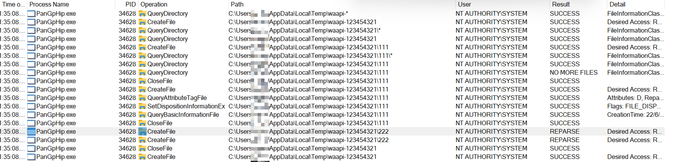

# CVE-2024-2432 Palo Alto GlobalProtect EoP

On Windows system, it was found that GlobalProtect (App version 6.1.1-5 and 6.2.0-89) was vulnerable to arbitrary file delete with elevated privileges by symbolic link attack lead to local privilege escalation on local machine.

It was observed that when a Windows unprivileged user attempt to connect VPN with GlobalProtect, the process "PanGpHip.exe" will do the following with SYSTEM privilege:

1. query directory "C:\Users\\\<user>\AppData\Local\Temp\waapi-*"

2. if there is any directory discovered, it will furthur query directory "C:\Users\\\<user>\AppData\Local\Temp\waapi-\<random>\\*"

3. if any files or directories were discovered in "C:\Users\\\<user>\AppData\Local\Temp\waapi-\<random>\*", it will remove them

4. finally remove direcory "C:\Users\\\<user>\AppData\Local\Temp\waapi-\<random>"

5. side note: the program can query nested directory but failed to open handle to it. So we can ignore this case



Since the directory "C:\Users\\\<user>\AppData\Local\Temp\waapi-\<random>" could be created by current user and assigned with "Modify" privilege for current user, current user could modify the entire directory. With this setup, an unprivileged user is able to achieve arbitrary file delete by creating a symbolic link to a privileged location (e.g., C:\Windows\System32). Furthermore, a malicious user could achieve local privilege escalation from arbitrary file delete.

To perform arbitrary file delete from a unprivileged user, the user could perform follow steps:

**Method 1**

1. User create folder "C:\Users\\\<user>\AppData\Local\Temp\waapi-1234567"

2. User create file "C:\Users\\\<user>\AppData\Local\Temp\waapi-1234567\12345.txt"

3. User set OpLock on file "C:\Users\\\<user>\AppData\Local\Temp\waapi-1234567\12345.txt"

4. User connect VPN. The process "PanGpHip.exe" will attempt to remove file "C:\Users\\\<user>\AppData\Local\Temp\waapi-1234567\12345.txt" with SYSTEM privilege. 

5. The process "PanGpHip.exe" will be paused due to the OpLock

6. When OpLock is triggered, user move file "C:\Users\\\<user>\AppData\Local\Temp\waapi-1234567\12345.txt" to somewhere else to empty the folder

7. User create junction "C:\Users\\\<user>\AppData\Local\Temp\waapi-1234567" to "\RPC Control"

8. User create symbolic link "GLOBAL\GLOBALROOT\RPC Control\12345.txt" to target file (e.g., C:\Windows\System32\secrets.txt)

9. User release OpLock

10. User delete symbolic link

11. Target file (e.g., C:\Windows\System32\secrets.txt) would be deleted

```
.\PoC.exe del C:\windows\System32\secrets.txt 1
```

**Method 2**

1. User create folder "C:\Users\<user>\AppData\Local\Temp\waapi-1234567" and "C:\Users\\\<user>\AppData\Local\Temp\fakedir-1234567"
2. User create file "C:\Users\<user>\AppData\Local\Temp\fakedir-1234567\11111.txt" and User create file "C:\Users\\\<user>\AppData\Local\Temp\fakedir-1234567\12345.txt"
3. User create junction "C:\Users\<user>\AppData\Local\Temp\waapi-1234567" to "C:\Users\\\<user>\AppData\Local\Temp\fakedir-1234567"
4. User set OpLock on file "C:\Users\\\<user>\AppData\Local\Temp\fakedir-1234567\11111.txt"
5. User connect VPN. The process "PanGpHip.exe" will attempt to remove file "C:\Users\\\<user>\AppData\Local\Temp\waapi-1234567\11111.txt" with SYSTEM privilege. 
6. The process "PanGpHip.exe" will be paused due to the OpLock
7. User remove existing junction and create junction "C:\Users\\\<user>\AppData\Local\Temp\waapi-1234567" to "\RPC Control"
8. User create symbolic link "GLOBAL\GLOBALROOT\RPC Control\12345.txt" to target file (e.g., C:\Windows\System32\secrets.txt)
9. User release OpLock
10. User delete symbolic link
11. Target file (e.g., C:\Windows\System32\secrets.txt) would be deleted

```
.\PoC.exe del C:\windows\System32\secrets.txt 2
```


To perform local privilege escalation from arbitrary file delete, we could leverage Windows Installer as described in this article https://www.zerodayinitiative.com/blog/2022/3/16/abusing-arbitrary-file-deletes-to-escalate-privilege-and-other-great-tricks.

**Method 1**

```
.\PoC.exe pe RollbackScript.rbs 1
```

**Method 2**

```
.\PoC.exe pe RollbackScript.rbs 2
```


cmd.rbs will spawn command prompt

public_run_bat.rbs will execute C:\Users\Public\run.bat


# Timeline

- 06/25/2023 - Vulnerability reported to Palo Alto
- 10/09/2023 - Palo Alto confirmed vulnerability 
- 13/03/2024 - Publication


# Reference

- https://security.paloaltonetworks.com/CVE-2024-2432